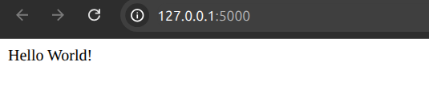

# 우분투 Flask 여정기
> 이 문서는 Flask 공식 문서를 통해 진행되었습니다.
>ubuntu 24.04버전입니다.
## 설치하기
``` sudo apt install python3-virtualenv ```
- 가상환경 라이브러리 설치

``` virtualenv venv ```
- 가상환경 설정 (이름 venv)

``` source ./venv/bin/activate ```
- 가상환경 실행 

## 빠르게 시작하기
```python
from flask import Flask
app = Flask(__name__)

@app.route('/')
def hello_world():
	return 'Hello World!'
if __name__=='__main__':
	app.run()
```

``` if __name__=='__main__':``` 의 경우 해당 파일(내 경우는 first.py)가 직접적으로 실행될 경우에만 app.run()을 실행할 수 있게 하는 것이다.

``` python first.py``` : 해당 파일을 실행시킨다. 



> 위의 first.py를 실행시키면 로컬서버에서만 접근이 된다. 디버그 모드로 호출이 되기 때문인데, 이럴때 app.run(host = '0.0.0.0')으로 실행시키면 로컬서버 뿐 아닌 해당 서버에 포함되어 있는 모두가 해당 파일에 접근할수 있다.

### 디버그 모드 
- first.py의 변경사항을 코드가 알아서 리로드 시켜 화면에 반영해 주는 것은 디버그 모드이다.
```python
if __name__=='__main__':
	app.run()
```
- 해당 부분에 debug = True를 넣으면 된다. 둘 다 같은 결과를 보여준다.
```python
if __name__=='__main__':
	#app.debug = True
	app.run(debug = True)
```
- 주요 보안 취약점이 될 수 있으므로, 운영 환경에서는 써먹지 말자.


## 라우팅 
- ```route()``` 데코레이터는 함수와 URL을 연결해준다.

```python
from flask import Flask
app = Flask(__name__)

@app.route('/')
def index():
    return 'Index Page'

@app.route('/hello')
def hello():
    return 'Hello World'

if __name__ == '__main__':
    app.run()
```

- 동작 방식

- http://127.0.0.1:5000/
→ index() 함수가 실행되어 **"Index Page"**가 보입니다.
- http://127.0.0.1:5000/hello
→ hello() 함수가 실행되어 **"Hello World"**가 보입니다.

## 변수 규칙
- Flask에서 URL 경로에 변수를 넣어서, 사용자가 입력한 값에 따라 다른 결과를 보여줄 수 있음

```python
@app.route('/user/<username>')
def show_user_profile(username):
    # show the user profile for that user
    return 'User %s' % username

@app.route('/post/<int:post_id>')
def show_post(post_id):
    # show the post with the given id, the id is an integer
    return 'Post %d' % post_id

```
- 위의 URL에 /user/<내가 원하는 유저 네임> 을 집어넣거나 , /post/<원하는 숫자> 를 넣으면 해당 화면에서 출려되는 형식이 다르다.

## URL 생성
- ```url_for()``` 함수를 사용하면 됨

```python 
from flask import Flask,url_for
app = Flask(__name__)

@app.route('/')
def index(): pass

@app.route('/login')
def login(): pass

@app.route('/user/<username>')
def profile(username): pass

with app.test_request_context():
    print(url_for('index'))
    print(url_for('login'))
    print(url_for('login', next='/'))
    print(url_for('profile', username='John Doe'))


if __name__ == '__main__':
    app.run(debug = True)

```
- 위를 실행후 파일을 실행하면 터미널에서 

```
/
/login
/login?next=/
/user/John%20Doe

```
- 템플릿에 URL을 하드코딩 하지 않는 이유 3가지
1. URL 역변환이 더 이해하기 쉬움, ex) url /login이 /user/login으로 변경되면 
>1.하드 코딩 : 모든 파일에서 /login을 찾아서 다 수정해야함

>2.url_for사용: Flask의 라우트만 바꾸면 템플릿은 그대로 둬도됨
2. 특수문자나 공백,유니코드의 경우 하드코딩은 직접 url을 수정해야함, 근대 url_for은 알아서 변환해줌
3. 웹 앱이 /가 아닌 /myapplication 밑에설치되면, 하드코딩은 ```<a href="/login"> → /myapplication/login```으로 다 바꿔야 함, url_for은 알아서 바꿔줌

## HTTP 메소드
| 메소드         | 설명                                          | 비고 / 사용 예시                                            |
| ----------- | ------------------------------------------- | ----------------------------------------------------- |
| **GET**     | 서버에서 **리소스를 조회**할 때 사용<br>URL에 쿼리 파라미터로 전달됨 | - 요청에 **본문(body)** 없음<br>- **안전한 요청** (조회만, 상태 변경 없음) |
| **POST**    | 서버에 **새 리소스를 생성**하거나, **데이터를 전달**할 때 사용     | - 폼 제출, 파일 업로드, 로그인 요청 등                              |
| **PUT**     | 대상 리소스를 **전체 교체** (또는 대체)                   | - `id`가 있는 경우 전체 수정<br>- 일부 수정에는 PATCH 권장             |
| **PATCH**   | 리소스의 **일부만 수정**할 때 사용                       | - `PUT`보다 효율적 (부분 수정)                                 |
| **DELETE**  | 서버의 리소스를 **삭제**할 때 사용                       | - 삭제 대상은 URL 경로로 지정                                   |
| **HEAD**    | **GET과 동일한 요청이지만 본문 없이** 응답 헤더만 반환          | - 리소스 존재 여부 확인, 용량 확인 등에 사용                           |
| **OPTIONS** | 해당 리소스에서 **지원하는 HTTP 메소드 목록**을 반환           | - \*\*CORS 사전 요청(preflight)\*\*에 사용됨                  |


```python
@app.route('/login', methods=['GET', 'POST'])
def login():
    if request.method == 'POST':
        do_the_login()
    else:
        show_the_login_form()
```
- GET: 로그인 폼을 보여줌 (보통 브라우저에서 주소창에 입력해서 들어오는 경우,사용자가 로그인 페이지에 들어올 때)
- POST: 로그인 폼에서 아이디/비밀번호를 입력해서 서버로 전송하는 경우(사용자가 로그인 폼을 제출할 때)

## 정적 파일
- 보통 자바스크립트나 CSS파일 
- 정적 파일에 대한 URL을 얻으려면 static을 사용해야함
```url_for('static', filename='style.css')```
- 이 파일(style.css)는 파일시스템에 static/style.css 로 저장되어야한다.

## 템플릿
- 파이썬 코드에서 직접 HTML만들면 코드가 복잡하고, 보안상의 위험이 있음
- FLASK는 Jinja2라는 템플릿 엔진을 사용해, HTML을 쉽게 만들고, 변수도 안전하게 처리함

### 템플릿 사용법
1. Flask는 기본적으로 templates 폴더에서 뎀플릿을 찾음(직접 만들어야함)
2. 코드에서 템플릿 렌더링 (이것도 html 만들어야함)

- templates 폴더를 만든 후 hello.html을 만들어
```html
<!DOCTYPE html>
<html lang="ko">
<head>
    <meta charset="UTF-8">
    <title>Hello from Flask</title>
</head>
<body>
    
        <h1>안녕하세요, {{ name }}!</h1>
    
        <h1>Hello World!</h1>
    
</body>
</html>

```
- 아래 코드를 실행시키면
```python
from flask import Flask, render_template

app = Flask(__name__)

@app.route('/hello/')
@app.route('/hello/<name>')
def hello(name=None):
    return render_template('hello.html', name=name)

if __name__ == '__main__':
    app.run(debug = True)
```
- 위 코드를 실행 후 /hello/홍길동 하면 '안녕하세요, 홍길동!' 이 출력되는 것을 확인할 수 있다.
- {{ name }} : 파이썬에서 넘겨준 name 변수를 출력
-  ...  ...  : 파이썬의 if문처럼 조건 분기

> 템플릿에서 {{ name }}처럼 변수를 출력하면,**자동으로 HTML 특수문자(예: <, >, &)를 변환(이스케이프)**해서 XSS(크로스사이트 스크립팅) 같은 보안 문제를 막아줍니다.


3. 템플릿 상속 : 여러 페이지에서 공통되는 부분을 '부모 템플릿'으로 만들고, 각 페이지에는 '자식 템플릿'으로 필요한 부분만 바꿔 쓸 수 있음

4. Markup 클래스와 |safe 필터
- 파이썬에서 Markup 클래스를 쓰거나
- 템플릿에서 |safe 필터를 씁니다.

## 요청 데이터 접근하기
- 클라이언트에서 서버로 보내는 데이터를 처리하는 것은 중요한 일임 Flask에서는 글로벌한 request 객체에 의해 제공됨.
### 컨텍스트 로컬
- Flask는 요청 컨테스트와 애플리케이션 컨텍스트를 사용해 각 워커(스레드/프로세스)별로 데이터를 격리함. 이는 동시 다중 요청이 들어와도 각 요청이 독립적으로 처리되도록 보장함.
	- request 객체는 현재 요청의 컨테스트에서만 유효함
	- 테스트 시 test_request_conetext() 로 가상 요청 환경 생성가능 

```python
with app.test_request_context('/hello', method='POST'):
    assert request.path == '/hello'  
```

### 데이터 유형별 접근 방법
1. 쿼리 파라미터 (GET)
- request.args 사용
```python
from flask import Flask, request

app = Flask(__name__)

@app.route('/search')
def search():
    searchword = request.args.get('key', '')
    return f'검색어: {searchword}'
```
- 위의 예시 URL:http://localhost:5000/search?key=apple


2. 폼 데이터 (POST)
- request.form으로 접근:

```python
from flask import Flask, render_template, request, redirect, url_for

app = Flask(__name__)

# GET 요청 시 로그인 폼을 렌더링
@app.route('/login', methods=['GET'])
def login_form():
    return render_template('login.html')

# POST 요청 시 로그인 데이터 처리
@app.route('/login', methods=['POST'])
def login():
    username = request.form['username']
    password = request.form.get('password', '')

    # 예시: 간단한 로그인 검증
    if username == 'admin' and password == '1234':
        return f'환영합니다, {username}님!'
    else:
        return '로그인 실패: 아이디나 비밀번호가 올바르지 않습니다.', 401

# 루트로 이동 시 로그인 페이지로 리디렉션
@app.route('/')
def index():
    return redirect(url_for('login_form'))

if __name__ == '__main__':
    app.run(debug=True)

```

- 위의 html 랜더링과 합쳐진 방식 

```html
<!-- templates/login.html -->
<!DOCTYPE html>
<html lang="ko">
<head>
    <meta charset="UTF-8">
    <title>로그인</title>
</head>
<body>
    <h2>로그인 폼</h2>
    <form method="POST" action="/login">
        <label for="username">아이디:</label>
        <input type="text" id="username" name="username" required><br><br>

        <label for="password">비밀번호:</label>
        <input type="password" id="password" name="password" required><br><br>

        <button type="submit">로그인</button>
    </form>
</body>
</html>

```

3. JSON 데이터
- request.json 또는 request.get_json() 사용

4. 파일 업로드
- request.files와 secure_filename() 조합:
```
from werkzeug.utils import secure_filename

f = request.files['the_file']
f.save(f'/uploads/{secure_filename(f.filename)}')  # [3][5]
```

5. 쿠키 처리
- 쿠키 읽기:

```python
username = request.cookies.get('username')  # [4]쿠키 저장:
```

```python
resp = make_response(render_template('...'))
resp.set_cookie('username', 'john', max_age=3600)  # [4]
return resp
```


## Flask에서 리다이렉션과 에러 처리

### **1. 리다이렉션 (Redirect)**

- 사용자가 다른 엔드포인트(페이지)로 이동시키고 싶을 때 사용
- `redirect()` 함수와 `url_for()` 함수를 조합하여 사용

```python
from flask import redirect, url_for

@app.route('/')
def index():
    return redirect(url_for('login'))
```

- 위 예시는 `/`로 접근하면 `/login`으로 이동

---

### **2. 에러 처리 (Abort \& Error Handler)**

- 요청을 강제로 중단하고 특정 에러 코드를 반환할 때 `abort()` 사용

```python
from flask import abort

@app.route('/login')
def login():
    abort(401)  # 401 Unauthorized 에러 발생
```

- `abort()` 호출 이후 코드는 실행되지 않음


#### **커스텀 에러 페이지**

- 기본 에러 페이지 대신, 원하는 템플릿으로 에러 페이지를 만들 수 있음
- `@app.errorhandler(에러코드)` 데코레이터 사용

```python
from flask import render_template

@app.errorhandler(404)
def page_not_found(error):
    return render_template('page_not_found.html'), 404
```

- 반환값의 두 번째 인자로 상태코드(예: 404)를 명시해야 함

---

### **3. 응답(Response) 반환 방식**

- Flask 뷰 함수에서 반환하는 값에 따라 자동으로 response 객체로 변환됨

| 반환값 유형 | 처리 방식 |
| :-- | :-- |
| 문자열 | 응답 body로 사용, 상태코드는 200, mimetype은 text/html |
| response 객체 | 그대로 반환 |
| 튜플 | (응답, 상태코드), (응답, 헤더), (응답, 상태코드, 헤더) 등 가능 |
| 기타 | WSGI application으로 간주 |

#### **make_response()로 직접 Response 객체 생성**

```python
from flask import make_response

@app.errorhandler(404)
def not_found(error):
    resp = make_response(render_template('error.html'), 404)
    resp.headers['X-Something'] = 'A value'
    return resp
```


---

### **4. 세션(Session)**

- 사용자별로 정보를 저장하고 싶을 때 사용
- Flask의 `session` 객체는 쿠키 기반이며 암호화되어 안전하게 저장됨
- 비밀키(`secret_key`)를 반드시 설정해야 함

```python
from flask import Flask, session, redirect, url_for, escape, request

app = Flask(__name__)
app.secret_key = 'A0Zr98j/3yX R~XHH!jmN]LWX/,?RT'

@app.route('/')
def index():
    if 'username' in session:
        return 'Logged in as %s' % escape(session['username'])
    return 'You are not logged in'

@app.route('/login', methods=['GET', 'POST'])
def login():
    if request.method == 'POST':
        session['username'] = request.form['username']
        return redirect(url_for('index'))
    return '''
        <form action="" method="post">
            <p><input type=text name=username>
            <p><input type=submit value=Login>
        </form>
    '''

@app.route('/logout')
def logout():
    session.pop('username', None)
    return redirect(url_for('index'))
```

- 비밀키는 반드시 충분히 랜덤하게 생성해야 함

```python
import os
os.urandom(24)
```


---

### **5. 메시지 플래싱 (Message Flashing)**

- 사용자에게 피드백 메시지를 보여주고 싶을 때 사용
- `flash()`, `get_flashed_messages()` 함수 활용

---

### **6. 로깅 (Logging)**

- 서버에서 발생하는 이벤트를 기록하고 싶을 때 사용

```python
app.logger.debug('디버깅 메시지')
app.logger.warning('경고 메시지')
app.logger.error('에러 메시지')
```


---

### **7. WSGI 미들웨어 연동**

- WSGI 미들웨어로 Flask 앱을 래핑할 수 있음

```python
from werkzeug.contrib.fixers import LighttpdCGIRootFix
app.wsgi_app = LighttpdCGIRootFix(app.wsgi_app)
```


---

### **8. 배포**

- Flask 앱은 다양한 호스팅 플랫폼에 배포 가능
- 소규모 프로젝트는 무료 플랫폼 사용 가능

---

**Tip:**

- 리다이렉션: `redirect(url_for('엔드포인트'))`
- 에러 응답: `abort(에러코드)`
- 커스텀 에러페이지: `@app.errorhandler(에러코드)`
- 세션: `session['키'] = 값`
- 로그: `app.logger.레벨('메시지')`
